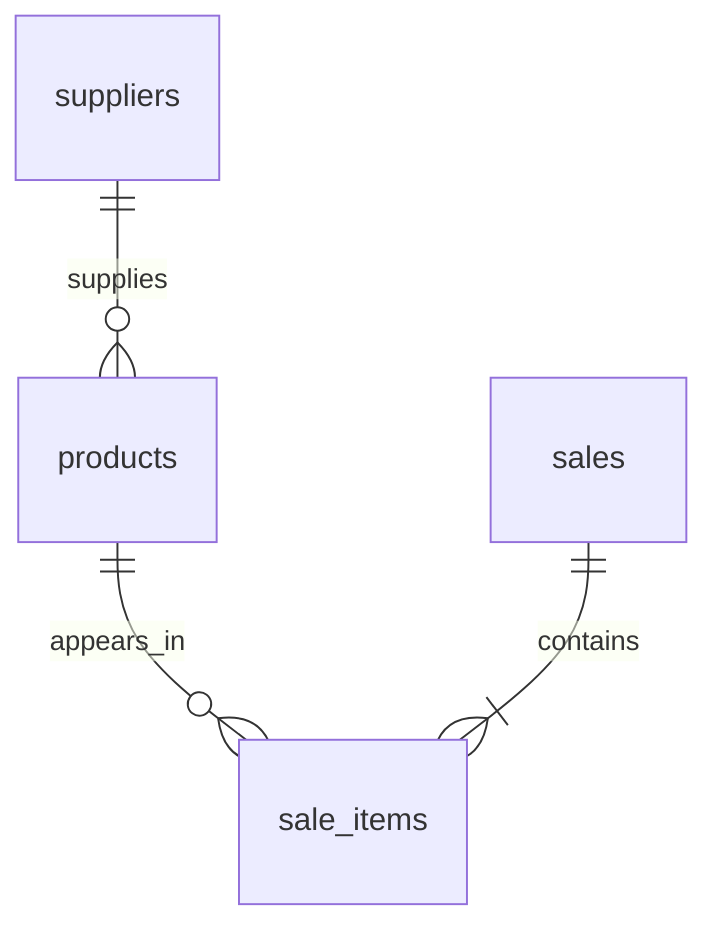

# Campus Stock — Inventory & Sales Analytics

A CIS internship portfolio project: a Python desktop dashboard backed by a normalized SQLite database. A fictional campus store uses it to review sales, compare products, and identify replenishment needs.

**All data is simulated.** This is an educational prototype, not a deployed business system. Generated with AI assistance; review and understand the code before describing your contributions in an interview.

## Run

Requires Python 3.9 or newer with Tkinter. No pip dependencies.

1. Download and unzip the project.
2. Open a terminal in the `campus-stock` folder.
3. Run `python3 app.py` (Windows: `py app.py`).

The first run creates `data/campus_stock.db` using a fixed random seed. Subsequent runs preserve it. A Python installation from python.org typically includes Tkinter. If your installation lacks it, install its Tkinter component; Ubuntu/Debian packages name it `python3-tk`.

For a terminal-only report: `python3 app.py --report`.

Run checks: `python3 -m unittest discover -s tests -v`.

## Dashboard

- Revenue, gross profit, units sold, and reorder-alert counts.
- Inclusive date filtering and category filtering.
- Monthly revenue bars and ranked product performance.
- Ending inventory with supplier and reorder status.
- CSV export of the displayed product performance, with money in cents.

The date range affects sales metrics. Inventory always reflects all recorded sales, as explicitly labeled in the app. Apply filters before exporting. Months without sales are absent from the chart.

## Business questions

1. Which products generate the most revenue and gross profit?
2. How does sales performance vary by month and category?
3. Which products have reached their reorder point?

## Architecture

```text
Deterministic sample generator -> SQLite database -> SQL queries -> Tkinter dashboard
                                                         -> terminal report / CSV
```



- `core.py`: data generation, database connection, analytics, export.
- `app.py`: desktop interface and terminal report.
- `sql/schema.sql`: tables, constraints, index, inventory view.
- `sql/analysis.sql`: parameterized product performance query.
- `tests/test_analytics.py`: reconciliation, arithmetic, filter, and integrity checks.
- `docs/PROJECT_BRIEF.md`: requirements, metric definitions, limitations.
- `docs/INTERVIEW_GUIDE.md`: explanation practice and resume wording.
- `docs/SAMPLE_REPORT.txt`: generated results for quick inspection.

## Design choices

Money uses integer cents to avoid floating-point rounding in stored amounts. Sale lines capture both price and cost at purchase time, so changes to a product catalog would not rewrite historical margin. Foreign keys enforce valid relationships, and a composite key prevents duplicate product lines within one sale. SQL parameters keep filter values separate from query code.

Inventory is computed as opening stock minus sold units, rather than manually maintaining a second balance. The generator limits sales to available stock. The schema itself does not prevent overselling across multiple transactions; a real sales-entry workflow would require transactional stock checks.

## Scope and limitations

This is a read-only analytics app with generated source data. It does not record purchases, returns, replenishments, taxes, discounts, customer information, authentication, or concurrent transactions. Gross profit excludes operating expenses and is not net profit. Reorder points are fixed demo assumptions, not forecasts. Some products sell out because the demo intentionally has no replenishments; observed sales do not measure unconstrained demand.

## Make it your own

Run the app, trace one SQL result manually, and complete an extension you can explain. Good next steps: add stock receipts with a movement ledger, import a validated sales file, or recreate the dashboard in Power BI. Keep a short record of what you changed and how you verified it.

The source files in this folder are ready to upload to GitHub. The database is generated locally on first run and is excluded by `.gitignore`.

## Verification in the build environment

All five automated tests passed, and the terminal report ran successfully. The system-provided macOS Python aborted when opening Tk; a newer bundled Python stayed running, but desktop automation could not inspect its window. The GUI has not been visually verified here. If the window fails to open, use a current Python installation with Tkinter; the terminal report remains available.
